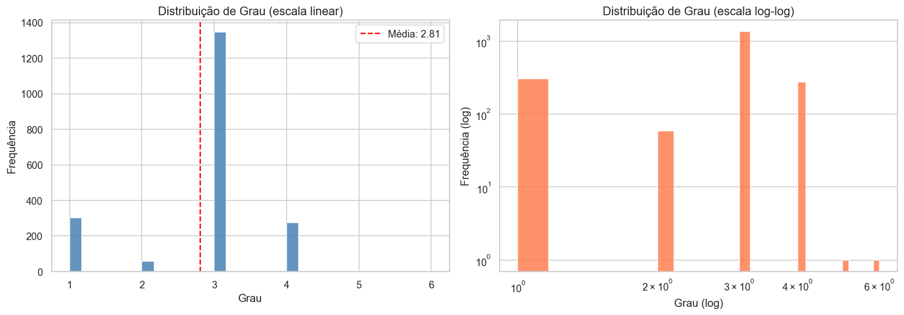
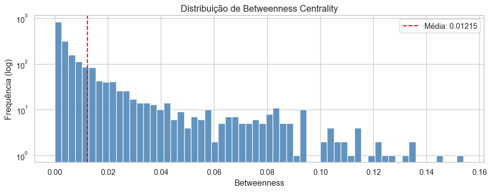
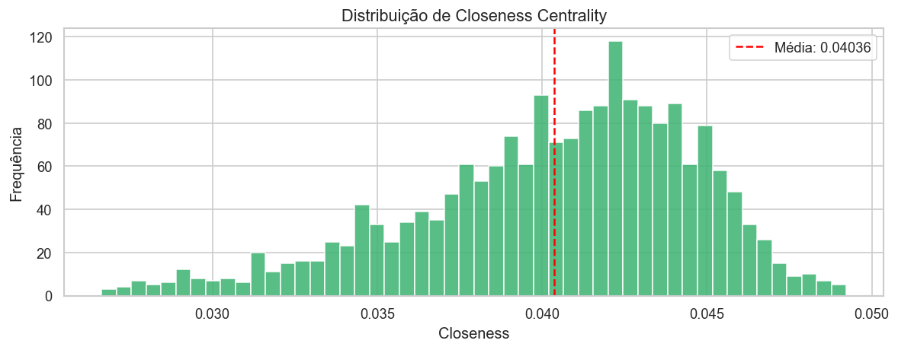
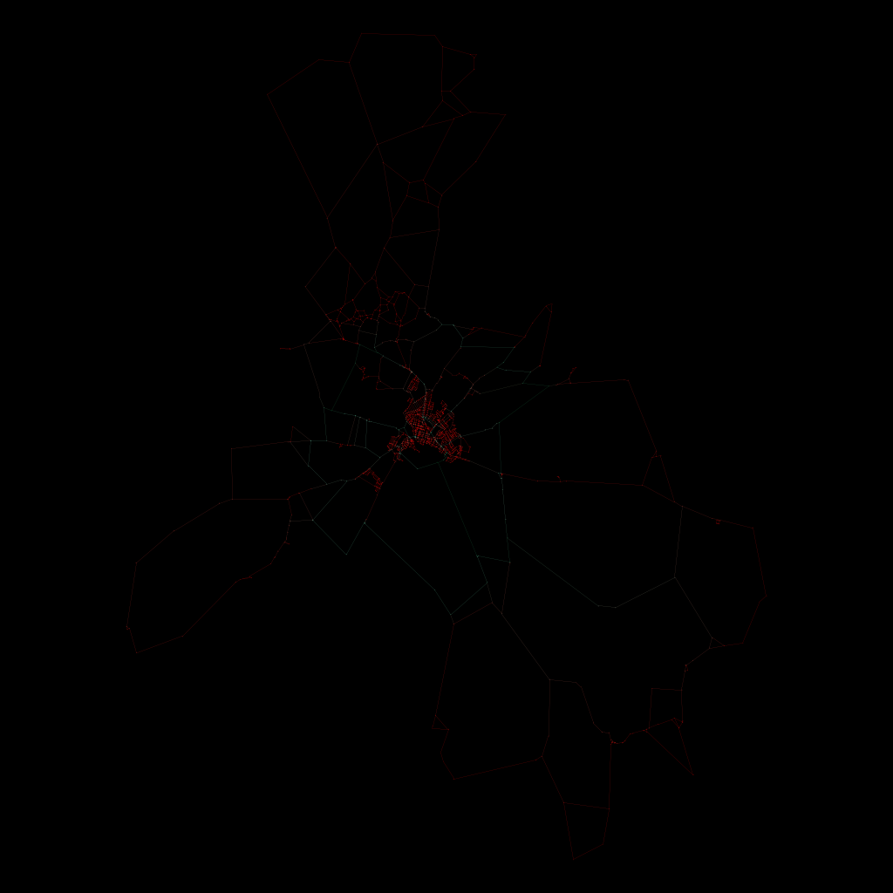
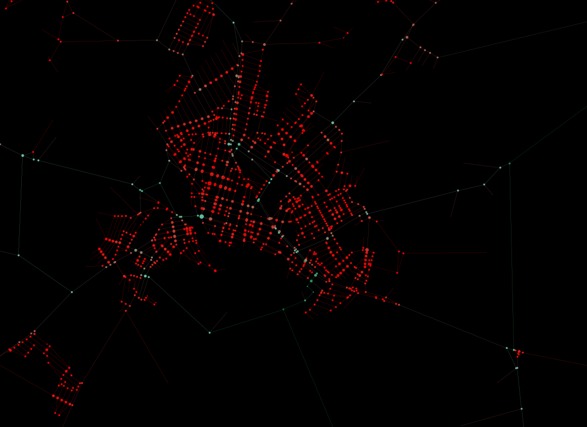
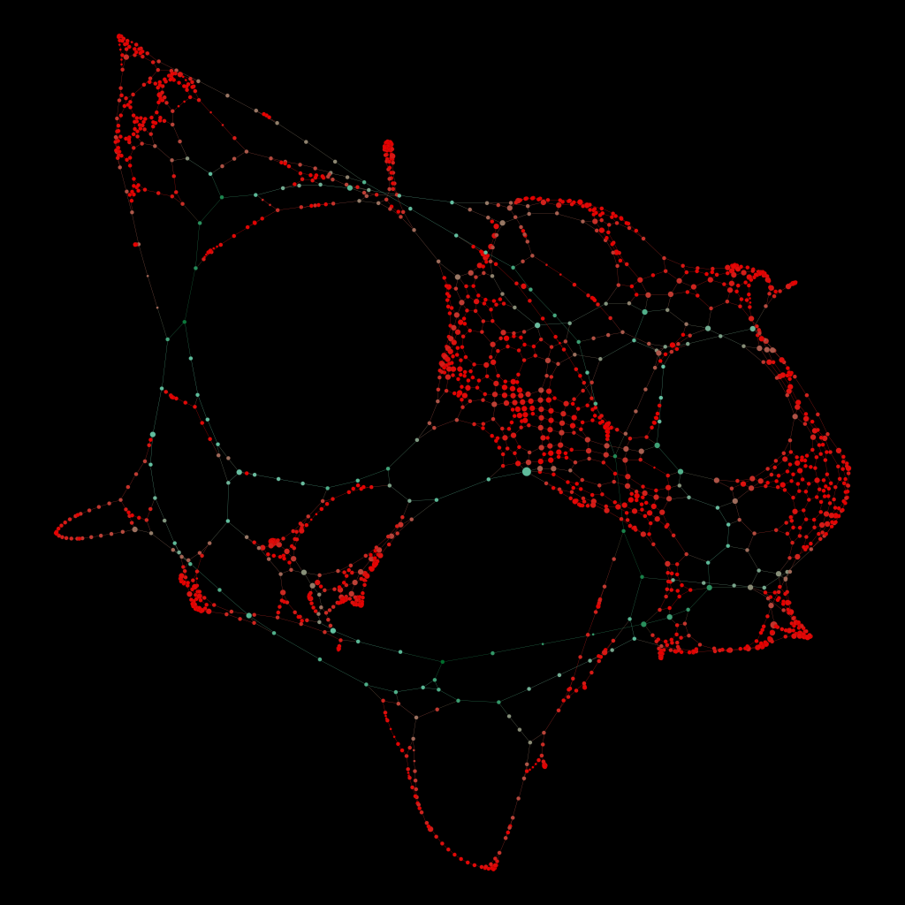
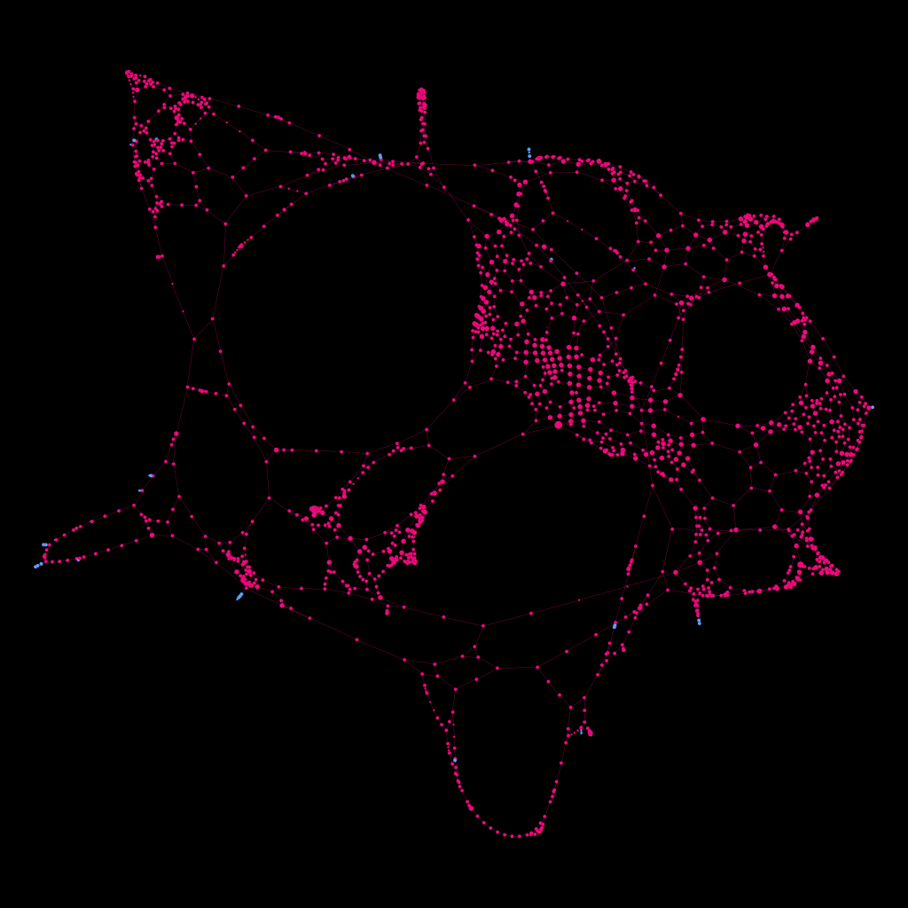
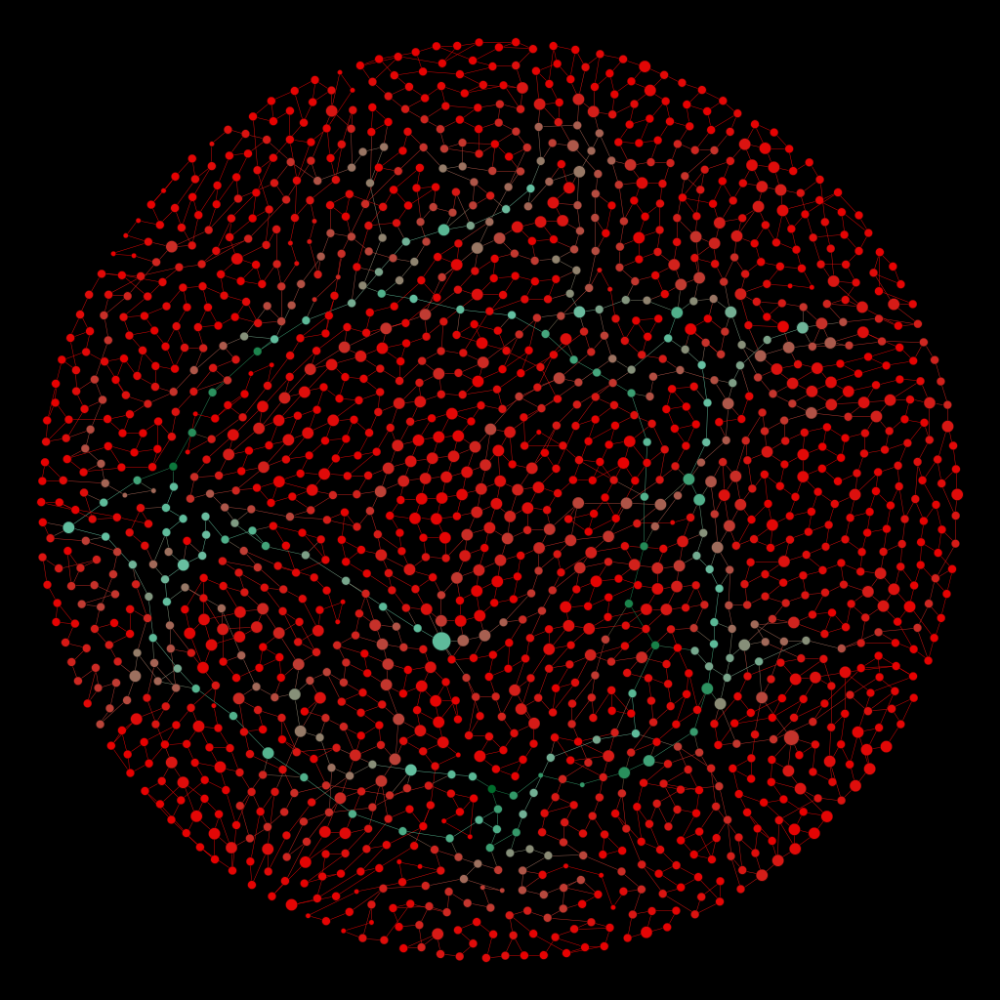

# Trabalho 2 – Análise Estrutural de Redes Urbanas
### Disciplina: Estrutura de Dados II (DCA3702)

#### Integrantes
* José Felix Rodrigues Anselmo
* Lucas Henrique Alves de Queiroz

**Região analisada:** Santa Cruz, Rio Grande do Norte, Brasil  
**Ferramentas:** OSMnx, NetworkX, Matplotlib, Seaborn, Gephi

---

## Local de Análise

O local escolhido pelo grupo foi Santa Cruz-RN, pela familiaridade com a localização, visto que possuímos familiares de lá.

---

## Objetivo

Analisar a malha viária de **Santa Cruz-RN** a partir de dados reais extraídos do OpenStreetMap, realizando:

* Extração da rede viária via OSMnx
* Conversão para grafo não-direcionado e extração do componente gigante
* Cálculo de métricas estruturais com NetworkX
* Exportação para Gephi com atributos de grau, betweenness, closeness e core number
* Geração de visualizações geográficas e estruturais

---

## Estrutura do Projeto

```
Trabalho_2/
|
├── grafico/
│   ├── Santa-Cruz.gephi
│   └── Santa-Cruz.graphml
|
├── imagens/
│   ├── Geolayout107.png
│   ├── centro.png
│   ├── Santa Cruz maps.png
│   ├── atlas02_bet_centrality.png
│   ├── ATLAS2_coremunber_color.png
│   ├── Fruchterman-Reingold.png
│   └── Hifan Hu.png
│
├── Trabalho_2_SantaCruz.ipynb
└── README.md
```

---

## Instalação

### Instalar dependências

```bash
pip install osmnx networkx matplotlib seaborn nxviz
```

---

## Execução

No Linux, após instalado o pacote Anaconda:

```bash
jupyter-notebook Trabalho_2_SantaCruz.ipynb
```

---

## Metodologia

| # | Etapa | Descrição |
|---|---|---|
| 1 | Carregamento | Extração da rede viária via OSMnx (`network_type="drive"`) |
| 2 | Pré-processamento | Conversão MultiDiGraph → Graph e extração do componente gigante |
| 3 | Distribuição de Grau | Histogramas linear e log-log |
| 4 | Betweenness Centrality | Identificação de nós-ponte críticos |
| 5 | Closeness Centrality | Nós mais acessíveis da rede |
| 6 | K-Core Decomposition | Núcleo mais denso da rede |
| 7 | Exportação para Gephi | GraphML com métricas e coordenadas geográficas |

---

## Resultados

O sistema gera visualizações estáticas (PNG) e um arquivo `.graphml` para uso no Gephi.

### Distribuição de Grau



A rede apresenta **grau médio de 2,81**, com a distribuição fortemente concentrada nos valores 1, 3 e 4. O grau 3 é amplamente dominante (cerca de 1.340 nós), o que reflete a predominância de cruzamentos em T na malha urbana de Santa Cruz. Os nós de grau 1 (~300) correspondem a vias sem saída ou extremidades periféricas, enquanto os de grau 4 (~270) representam cruzamentos em formato de X, mais comuns no centro urbano. A ausência de nós com grau 5 ou 6 confirma que a rede não possui hubs com muitas conexões — comportamento esperado em redes viárias, que diferem estruturalmente de redes sociais ou da internet.

### Betweenness Centrality



A distribuição de betweenness é fortemente assimétrica (cauda longa), com **média de 0,01215** e escala logarítmica necessária para visualização. A vasta maioria dos nós possui betweenness próxima a zero, enquanto um pequeno grupo de nós alcança valores entre 0,10 e 0,16 — cerca de 10 vezes acima da média. Esses nós de alto betweenness são os pontos críticos de passagem da rede: se congestionados ou removidos, afetam o fluxo de grande parte da cidade. Sua localização, concentrada nas vias principais do centro, é confirmada pelo recorte do GeoLayout no Gephi.

### Closeness Centrality



A distribuição de closeness é aproximadamente **normal**, centrada na **média de 0,04036**, com valores variando entre 0,025 e 0,050. Esse padrão é bastante diferente do betweenness: indica que a acessibilidade da rede é relativamente homogênea entre os nós, sem extremos muito discrepantes. Os nós com closeness mais alta (~0,048–0,050) são aqueles que conseguem alcançar todos os demais com o menor número de passos, situados tipicamente nas vias centrais. Os de closeness mais baixa (~0,025–0,028) são os nós periféricos, mais distantes estruturalmente do restante da rede.

---

## Visualização usando Gephi

Foi utilizado o Gephi para visualizar a malha viária de Santa Cruz usando os dados gerados na análise dos grafos.

Requisitos de configuração atendidos:

* Tamanho do nó proporcional ao grau
* Cor do nó associada ao core number
* Destaque dos nós com maior betweenness
* Visualização do subgrafo correspondente ao k-core escolhido

### GeoLayout

Dados usados:
* Scale: 1.0E7
* Latitude
* Longitude



Por se tratar de uma cidade de interior, é possível observar pontos bastante distantes entre si e uma grande concentração no centro do município. A escala geográfica foi mantida para preservar as distâncias reais.



O recorte central evidencia a concentração dos nós com maior betweenness próximos à região central do município.

Comparação com o mapa real:


### ATLAS 2

Itens usados na geração do gráfico:
* Tamanho dos nós proporcional ao Degree
* Cor usando Betweenness Centrality



* Cor usando K-Core (Rosa: 82,21% / Azul: 17,19%)
* Tamanho dos nós proporcional ao Degree



### Fruchterman-Reingold

Usando as configurações padrão:



### Yifan Hu

Usando as configurações padrão:


---

## Link Video LOOM 
https://www.loom.com/share/8119c0cd567c4b0287cfb47fb2bab8b4

---

## Tecnologias

* Python
* OSMnx
* NetworkX
* Matplotlib
* Seaborn
* Gephi

---

## Referências

* [https://osmnx.readthedocs.io/](https://osmnx.readthedocs.io/)
* [https://networkx.org/](https://networkx.org/)
* [https://matplotlib.org/](https://matplotlib.org/)
* [https://gephi.org/](https://gephi.org/)

---

## Conclusão

O projeto aplicou conceitos de grafos sobre a malha viária real de Santa Cruz-RN, identificando os elementos estruturais mais importantes por meio de métricas de grau, betweenness, closeness e k-core. A distribuição de grau revelou uma rede dominada por cruzamentos simples (grau 3), sem hubs expressivos. O betweenness destacou um pequeno conjunto de nós centrais críticos para o fluxo da cidade, enquanto o closeness mostrou que a acessibilidade geral da rede é relativamente uniforme. A visualização geográfica confirmou que o centro do município concentra os principais nós de conexão da rede, enquanto os layouts estruturais do Gephi evidenciaram a hierarquia e a densidade da malha viária de forma mais clara.
